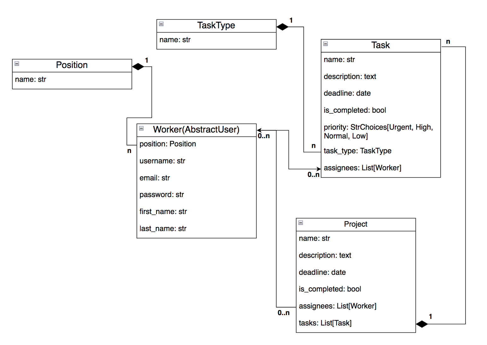
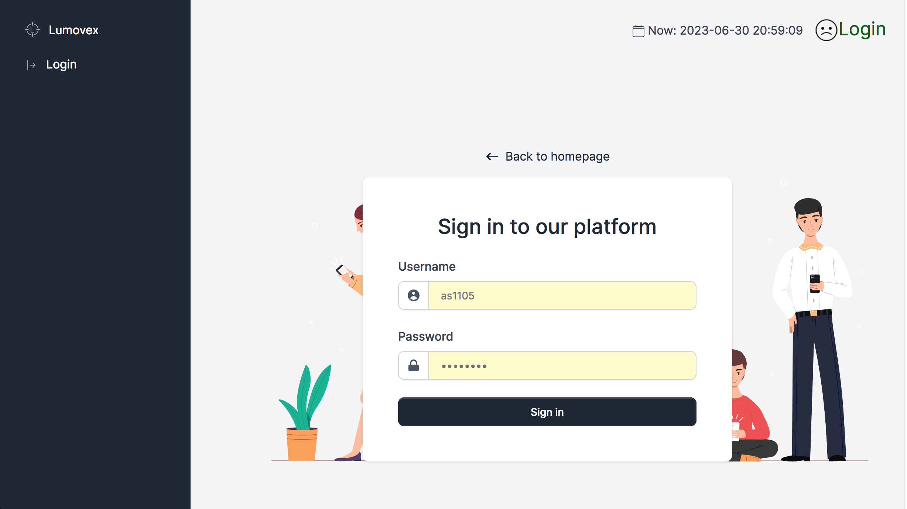
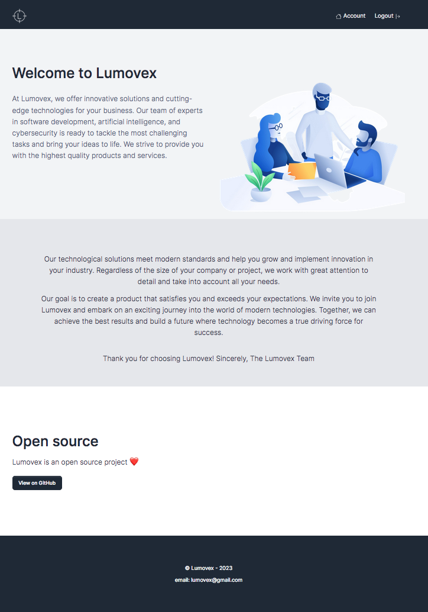
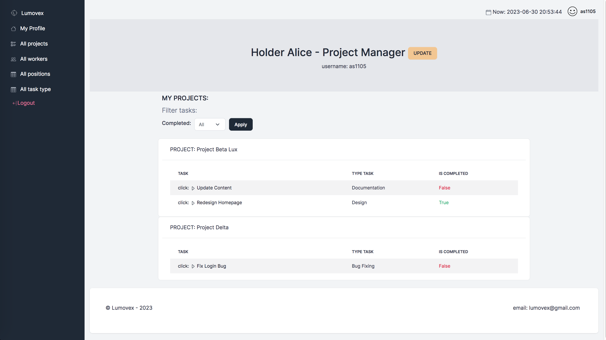

# Lumovex IT Company Task Manager
>The Lumovex IT Company Task Manager is a tool designed for managing projects, tasks, employees, and task types within the IT company Lumovex.


### Check it out!

[IT Company task manager deployed to Render](https://it-company-task-manager-btlb.onrender.com/#top)

TEST USER:

login: sjohnson

password: 89fDmvmvJmcZNuj

### Installation
To start using the Lumovex IT Company Task Manager, follow these steps:

Python3 must be already installed

```shell
git clone https://github.com/xtina999/it-company-task-manager
cd it_company_task_manager
python3 -m venv venv
source venv/bin/activate
pip install -r requirements.txt
python manage.py makemigrations
python manage.py migrate
python manage.py createsuperuser
python manage.py runserver
```


### Features of Lumovex IT Company Task Manager:

* User Authentication: The system is built on the Django authentication system (django.contrib.auth.models.AbstractUser), which handles user registration, login, and access control.
* Company Homepage for All Users: The company's main homepage is accessible to all users for viewing.
* Personal Employee Dashboard: Upon authorization, each employee is directed to their personal dashboard, displaying their assigned projects and tasks.
* Task Search Filter: Employees can use a filter to search for tasks based on specific criteria.
* Access to Lists: Employees have access to lists of all positions, task types, projects, and employees.
* Adding, Deleting, and Editing Data: Projects, tasks, employees, positions, and task types can be added, deleted, and edited.


### Usage:
Key elements and their relationships within the Lumovex IT Company Task Manager:
* Project: Each project has a name, description, deadline, and a list of assigned workers. Projects are used to organize and manage tasks.
* Task: Tasks are created within projects and represent specific assignments. They contain information such as name, description, creation date, deadline, completion status, priority, task type, assigned workers, and the project they belong to.
* Worker: Workers are employees of the IT company. Each worker has a name, position, and can be assigned to projects and tasks.
* Position: Positions represent different roles or job positions within the company. Each worker is associated with a specific position.
* TaskType: Task types categorize tasks based on different types or categories.


##### DB structure



### Access Control:

* The company's main homepage is accessible to all users.
* The rest of the functionality is accessible only to authorized employees of the company.
* Upon authorization, employees are directed to their personal page displaying their projects and tasks.

### Data Editing:

Projects, tasks, employees, positions, and task types can be added, deleted, and edited.


### Demo
##### 1. Login page

##### 2. Home page

##### 3. Account page

